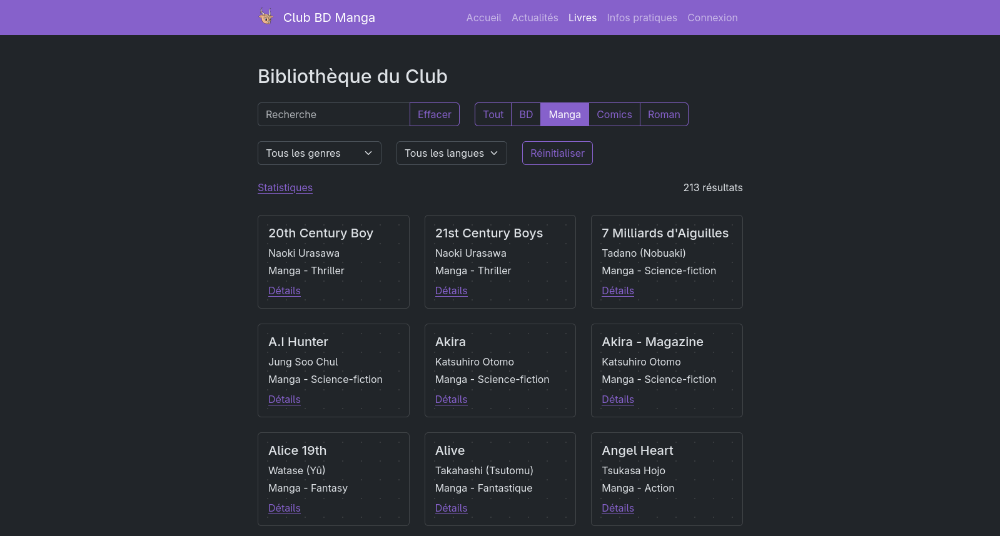

# Club BD Manga

Application de gestion de l'inventaire et des emprunts de la bibliothèque du Club BD Manga de l'INSA Lyon. Elle présente aussi les actualités de l’association, avec les informations pratiques pour la rejoindre.



L'application est écrite en Python avec le framework [Django](https://www.djangoproject.com/). 🐍

## Développement

### Installation en local

- `git clone https://github.com/Lysquid/ClubBDManga`
- `python -m venv env`
- `source env/bin/activate`
- `pip install .`
- installer `mariadb` ou `mysql` (les deux sont interchangeables)
- `mariadb -u root -p -e "create database BDMANGA"`
- définir les variables d'environnement suivantes :
  - `DB_NAME=BDMANGA`
  - `DB_USER=root` (utilisateur de la db)
  - `DB_PASSWORD=*****` (mot de passe de l'utilisateur)
  - `DEBUG=1` pour faciliter le développement
- `python manage.py migrate` (créé le schéma de la base de donnée)
- `python manage.py createsuperuser` (pour avoir accès au site admin)
- `python manage.py runserver`

Le docker-compose peut également être utilisé en local, pour ne rien à avoir d'autres à installer que Docker. Il faut alors définir les variables d'environnement dans un fichier `.env`. Cette méthode reste moins pratique pour le développement, car elle a été prévue pour le déploiement.

### Backups

Des backups journalières de la base de donnée sont réalisées sur le serveur avec une GitHub action. Il faut penser à les copier régulièrement, par exemple avec `scp`. Il peut aussi être utile de créer des backups manuellement, et surtout de les restaurer :

#### En local

```sh
mariadb-dump -u root -p BDMANGA > dump.sql
```

```sh
mariadb -u root -p BDMANGA < dump.sql
```

#### Avec docker

```sh
docker exec -i clubbdmanga-db-1 mariadb-dump -u django -p BDMANGA > dump.sql
```

```sh
cat dump.sql | docker exec -i clubbdmanga-db-1 mariadb -u django -p BDMANGA
```

## Déploiement

Le déploiement se fait automatiquement sur le serveur hébergeant l'action runner à chaque push sur `main`, ou en lançant l'action manuellement. Il y a une autre action pour arrêter l'application.

### Déploiement sur un nouveau serveur

- Installer Docker et nginx.
- Définir les variables d'environnement comme plus haut, et ajouter :
  - `SITE_URL=bdmanga.asso-insa-lyon.fr`
  - `SECRET_KEY=************` a générer avec `django.core.management.utils.get_random_secret_key`
  - `DEBUG=0` (DEBUG=1 compromet la sécurité)
- Clone et lancer l'application avec `docker compose up --build`
- Copier [nginx.conf](nginx.conf) dans `/etc/nginx/sites-available/bdmanga`
- `ln -s /etc/nginx/sites-available/bdmanga /etc/nginx/sites-enabled/bdmanga`
- `sudo systemtcl reload nginx`
- Vérifier que le site est accessible en HTTP (malgré l'avertissement que la connexion n'est pas sécurisée).
- Installer [Certbot](https://certbot.eff.org/instructions) et suivre les instructions pour générer un certificat, en laissant Certbot modifier la config nginx.
- `sudo systemtcl reload nginx`
- Le site doit maintenant être accessible en HTTPS.

Plutôt que de définir les variables et lancer l'application manuellement, on peut utiliser les actions avec un self hosted runner. Les paramètres du repo fournissent un script pour l'installer. Les variables doivent alors être définies dans un "environnement" GitHub, là encore dans les paramètres du repo.
