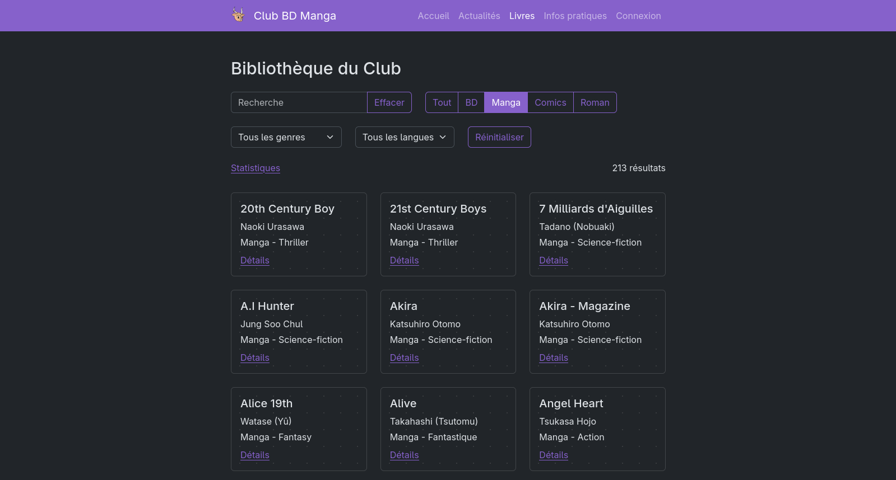

# Club BD Manga

Application de gestion de l'inventaire et des emprunts de la bibliothèque du Club BD Manga de l'INSA Lyon. Elle présente aussi les actualités de l’association, avec les informations pratiques pour la rejoindre.



L'application est écrite en Python avec le framework [Django](https://www.djangoproject.com/). 🐍

## Développement

### Installation en local

- installer `mariadb` ou `mysql` (les deux sont interchangeables)
- `mariadb -u root -p -e "create database BDMANGA"`
- cloner le projet
- `python -m venv env`
- `source env/bin/activate`
- `pip install -r requirements.txt`
- créer un fichier `.env` et définir les variables d'environnement suivantes :
  - `export DB_NAME=BDMANGA`
  - `export DB_USER=root` (utilisateur de la db)
  - `export DB_PASSWORD=*****` (mot de passe de l'utilisateur)
  - `export DEBUG=1` pour faciliter le développement
- `source .env`
- `python manage.py migrate` (créé le schéma de la base de donnée)
- `python manage.py createsuperuser` (pour avoir accès au site admin)
- `python manage.py runserver`

### Installation avec Docker

- installer Docker
- cloner le projet
- créer un fichier `.env` et définir les mêmes variables d'environnements.
- `docker compose up --build`

Docker est prévu pour le déploiement. Ce n'est pas pratique pour le développement, car il faut rebuild à chaque changement (à moins d'adapter le `docker-compose.yml`).

### Backups

Des backups journalières de la base de donnée sont réalisées sur le serveur avec une GitHub action. Il faut penser à les copier régulièrement, par exemple avec `scp`. Il peut aussi être utile de créer des backups manuellement, et surtout de les restaurer :

#### En local

```sh
mariadb-dump -u root -p BDMANGA > dump.sql
```

```sh
mariadb -u root -p BDMANGA < dump.sql
```

#### Avec docker

```sh
docker exec -i clubbdmanga-db-1 mariadb-dump -u django -p BDMANGA > dump.sql
```

```sh
cat dump.sql | docker exec -i clubbdmanga-db-1 mariadb -u django -p BDMANGA
```

Pour avoir un shell dans docker :

```sh
docker exec -it clubbdmanga-app-1 bash
```

## Déploiement

Le déploiement se fait automatiquement sur le serveur hébergeant l'action runner à chaque push sur `main`, ou en lançant l'action manuellement. Il y a une autre action pour arrêter l'application.

### Déploiement sur un nouveau serveur

- Installer Docker et nginx.
- Définir les variables d'environnement comme plus haut, et ajouter :
  - `SITE_URL=bdmanga.asso-insa-lyon.fr`
  - `SECRET_KEY=************` a générer avec `django.core.management.utils.get_random_secret_key`
  - `DEBUG=0` (DEBUG=1 compromet la sécurité)
- Clone et lancer l'application avec `docker compose up --build`
- Copier [nginx.conf](nginx.conf) dans `/etc/nginx/sites-available/bdmanga`
- `ln -s /etc/nginx/sites-available/bdmanga /etc/nginx/sites-enabled/bdmanga`
- `sudo systemtcl reload nginx`
- Vérifier que le site est accessible en HTTP (malgré l'avertissement que la connexion n'est pas sécurisée).
- Installer [Certbot](https://certbot.eff.org/instructions) et suivre les instructions pour générer un certificat, en laissant Certbot modifier la config nginx.
- `sudo systemtcl reload nginx`
- Le site doit maintenant être accessible en HTTPS.

Plutôt que de définir les variables et lancer l'application manuellement, on peut utiliser les actions avec un self hosted runner. Les paramètres du repo fournissent un script pour l'installer. Les variables doivent alors être définies dans un "environnement" GitHub, là encore dans les paramètres du repo.
